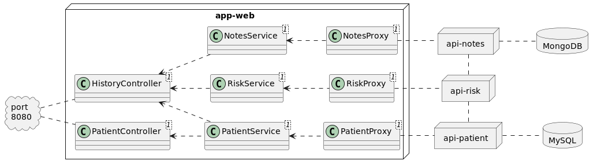
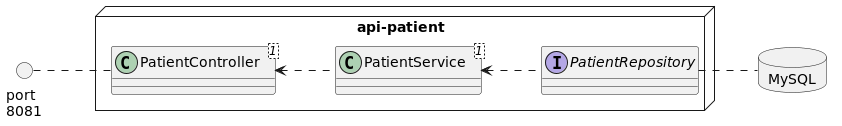
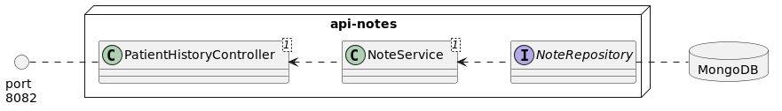
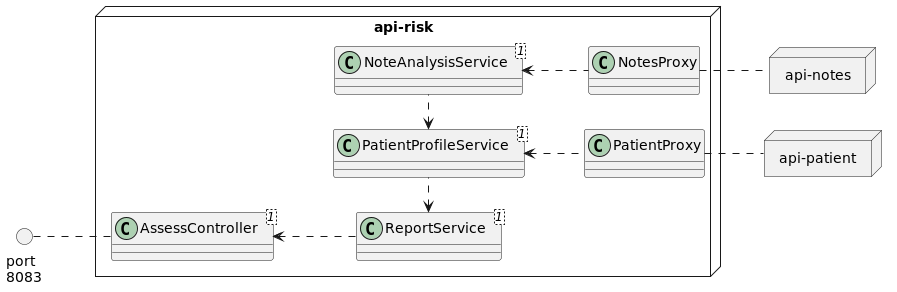
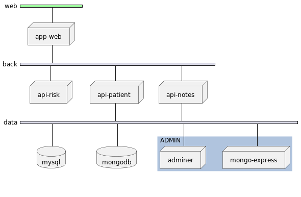

# Mediscreen

A learning exercise about separating features into microservices.

## Running the demo
#### Requirements:
- Docker
- Docker-Compose
#### Run commands:
```
docker-compose build
docker-compose up --no-start
docker-compose start
sh data-setup/sample-data.sh
```
#### Home screen:
Browse to http://localhost:8080
## Technical specifications

The project uses the following technologies:
- Maven
- Java 11
- Spring Boot 2.7
- Thymeleaf
- Bootstrap 5
- MySQL
- MongoDB
- Docker
- Docker Compose

## Project structure

The main application is in the module "app-web". It implements an internal website that the employees of the clinic can use to manage patient visits. It connects to the other modules and generates the UI needed for the user to interact with the data:


The "patient" API specializes in patient profiles (name, phone number, etc.). It uses a relational database.


The "notes" API has CRUD endpoints for the notes writen after each visit to the clinic. Because the notes don't have a size limit, it stores the documents in a non-relational database.


Finally, the "risk" API offers a service to analyze the data in the other two databases, and produce an assessment report:


## API Documentation

The detailed description of all the endpoints is in [docs/api-docs.pdf](docs/api-docs-v1.pdf)

## Development environment

There are 2 Spring Boot profiles available:
- **"dev" (default):** 
  - api-patient uses in-memory H2 database.
  - api-notes looks for MongoDB in localhost.
- **"prod":** 
  - api-patient uses mysql in a container named "db"
  - api-notes looks for MongoDB in a container named "mongo"

If needed, both modules have a "resources" folder with the configuration of each environment.

## Setting up MySQL - API Patient

The module "api-patient" doesn't need root access. It connects to the database using a user named "apiuser" with password "dbpassword". This can be changed in the resources file [application-prod.properties](api-patient/src/main/resources/application-prod.properties).

The file [data-setup/schema.sql](data-setup/schema.sql) can be run to setup the database automatically. It is intended to run with root permissions and has 3 stages:
1. First, it creates the database "mediscreen"
2. Then (re)creates the user "apiuser" and grants it limited permissions
3. Finally, it creates the table "patient"

This schema is also used in the [Dockerfile](Dockerfile), as an example of how to deploy a container with the needed configuration. In a different environment, the application-prod.properties will need to be updated so that the application can discover the database server.

## Setting up MongoDB - API Notes

Similarly, the module "api-notes" has a [resources](api-notes/src/main/resources) folder with the configuration. "dev" is the default, and "prod" is intended for a containerized environment.

## Sample data

Once both modules are running and connected to their respective databases, choose one of the SHELL scripts in the folder [data-setup](data-setup):
- "test-data.sh" will populate 4 test patients and some doctor's notes. This is only to verify that the "api-risk" module gives the four different risk levels indicated by the patient's name. (For example, it will give an assessment of "borderline" risk when asked for patient Id 2, name "TestBorderline")
- "sample-data.sh" contains more realistic data

## Deployment with Docker Compose

The [Dockerfile](Dockerfile) will run `mvn verify` and then build the following images:
- p9_mediscreen_8080_web:latest
- p9_mediscreen_8081_patient:latest
- p9_mediscreen_8082_notes:latest
- p9_mediscreen_8083_risk:latest
- p9_mediscreen_db:latest

The last one is a MySQL server that will run on startup the schema needed for api-patient. 

The rest are web servers running each JAR with the PROD configuration in their respective **application-prod.properties**. Note that the images are built in Java 19 for increased performance.

These images can be used to build containerized services. The file [docker-compose.yaml](docker-compose.yaml) is an example of how it could be deployed, and is fully functional:

| Service name     | Container     | Networks   | Port                  |
|------------------|---------------|------------|-----------------------|
| 8080_web         | app-web       | web, back  | 8080 (exposed)        |
| 8081_patient     | api-patient   | back, data | 8081                  |
| 8082_notes       | api-notes     | back, data | 8082                  |
| 8083_risk        | api-risk      | back       | 8083                  |
| db               | mysql         | data       | 3308                  |
| 8084-admin-db    | adminer       | data       | 8084 (localhost only) |
| mongo            | mongodb       | data       | 27017                 |
| 8085-admin-mongo | mongo-express | data       | 8085 (localhost only) |

Note that port 8080 is exposed so that clients outside of the networks can access the server. Ports 8084 and 8085 are for admin tools and are only visible to the machine that hosts the containers (not to other containers in the "data" network).



## Test coverage

Each module generates a `target/site/jacoco/index.html` showing the test coverage.
